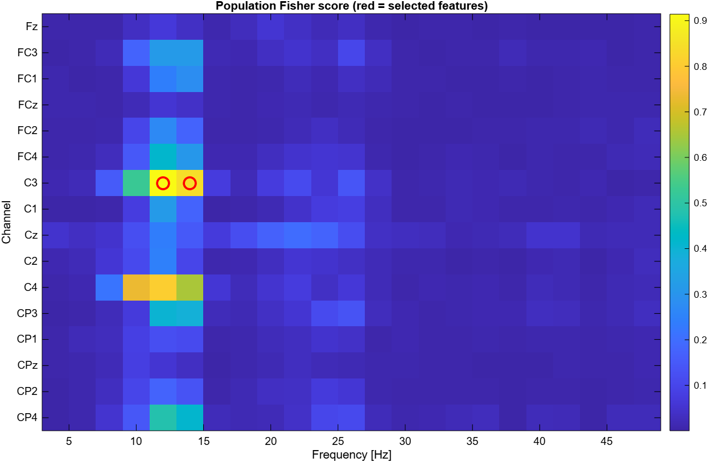
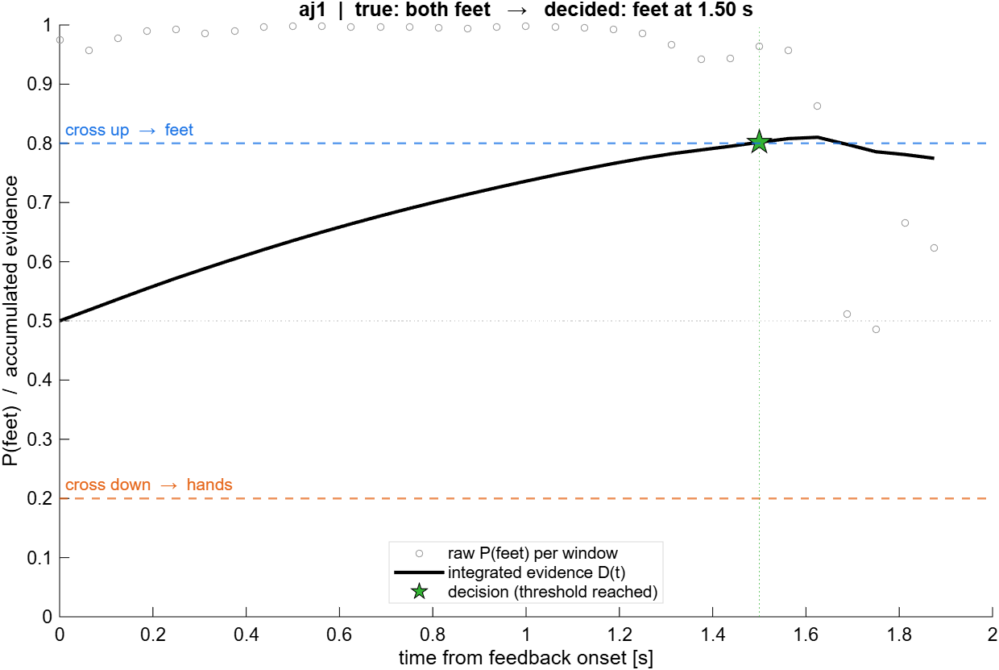
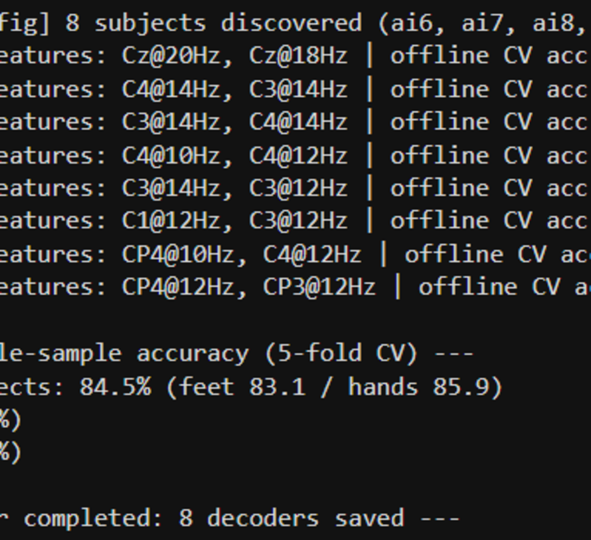

# Assignment 1 - Motor-Imagery BCI decoding

Neurorobotics 2025/2026

Analysis of a 3-day motor-imagery BCI experiment (8 subjects): population grand
average + per-subject calibration/online decoding with an evidence-accumulation
control framework.

> The full methods, results and discussion are in the **report (PDF)**.
> This README only explains how to run the code.

## Preview

  
  

Left: population Fisher map (the most discriminative channel-frequency features).
Right: evidence accumulation on one trial, where the integrated evidence reaches
the decision threshold. Example console output of `train_decoder`:

## Requirements

- MATLAB with the **Signal Processing** and **Statistics and Machine Learning** toolboxes.
- **EEGLAB** (`topoplot`) and **BioSig** (`sload`) on the path — added by `matlab/startup_neurorobotics.m`.
- Dataset in `matlab/data/raw/<subject>/*.gdf` (one folder per subject).
- `matlab/data/external/laplacian16.mat` and `chanlocs16.mat`.

## How to run

1. Run `matlab/startup_neurorobotics.m` once (adds EEGLAB, BioSig, utils).
2. From `assignments/assignment1/scripts/`, run the scripts **in order**:

| # | Script | Purpose |
|---|---|---|
| 1 | `process_all_runs` | Spectrogram processing of every run → `data/processed/assignment1/` (heavy, run once) |
| 2 | `grand_average` | Analysis 1 — population Fisher map + ERD/ERS topographies |
| 3 | `train_decoder` | Analysis 2a — per-subject feature selection + classifier (saves one decoder per subject) |
| 4 | `evaluate_online` | Analysis 2b — online evaluation + evidence accumulation |
| 5 | `results_summary` | Analysis 2c — offline vs online metrics + report figures |

`assignment1_config.m` is a **configuration function** called by every script
(not run directly). All parameters (paths, frequency band, number of selected
features, control-framework thresholds) are set there.

## Outputs

- Figures: `assignments/assignment1/figures/`
- Processed data and decoders: `matlab/data/processed/assignment1/`

## Notes

- Per the submission rules, raw and processed EEG data are **not** included in the submission.
- Reusable functions live in `matlab/utils/` (see `MATLAB_Utils_Reference.md`).

## Contributions

This assignment was carried out **individually by LORANDI Enzo** - data processing,
all analysis scripts (`process_all_runs`, `grand_average`, `train_decoder`,
`evaluate_online`, `results_summary`), reusable utilities, and the report.

