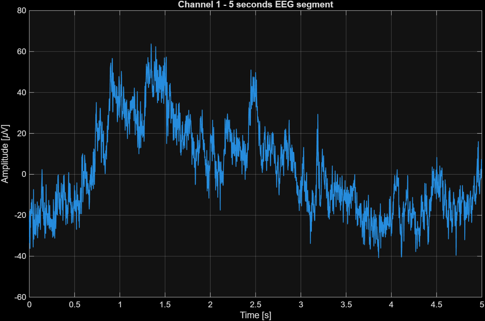
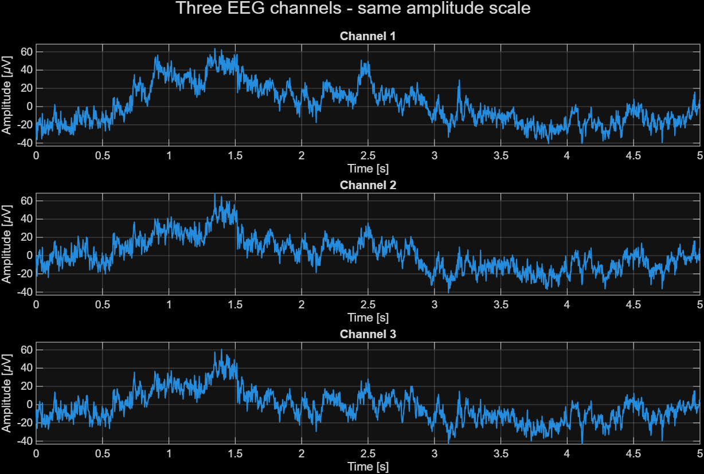
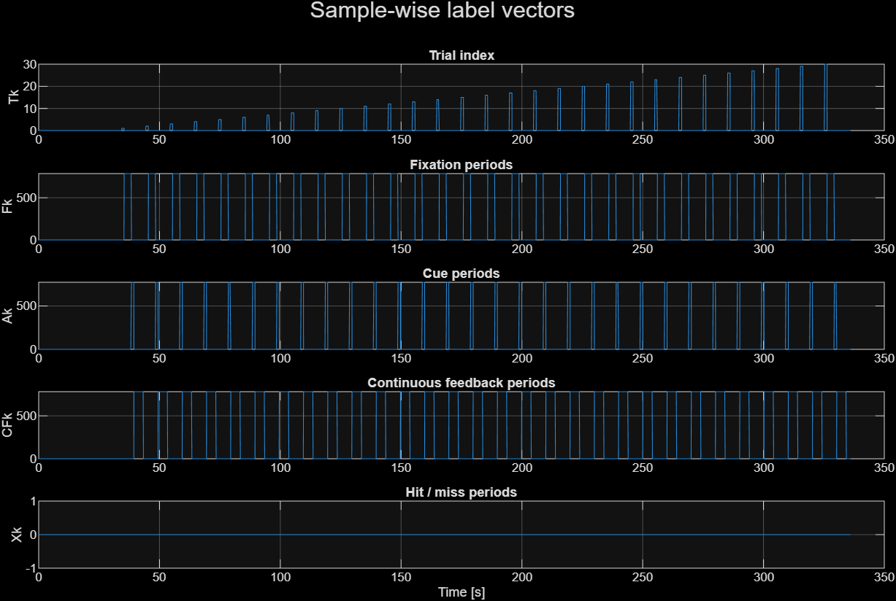

# Lab02 - GDF Data Format and EEG Manipulation

## Objective

This lab introduces the manipulation of EEG data stored in GDF format.

The goal is to:

- load a GDF file using the BioSig toolbox;
- inspect the EEG signal and the GDF header;
- visualize short EEG segments;
- create sample-wise label vectors from GDF events.

## Input data

The lab uses the first offline GDF file:

```text
data/raw/ah7.20170613.161402.offline.mi.mi_bhbf.gdf
```

Raw EEG data files are not versioned in Git.

## Scripts

### `lab02_01_load_and_plot_gdf.m`

Loads the first GDF file and displays basic information:

- signal size;
- sample rate;
- recording duration;
- first events from the GDF header.

It also plots:

- 5 seconds of one EEG channel;
- 5 seconds of three EEG channels using the same amplitude scale.

### `lab02_02_create_label_vectors.m`

Creates sample-wise label vectors from the GDF events:

- `Tk`: trial index;
- `Fk`: fixation period;
- `Ak`: cue period;
- `CFk`: continuous feedback period;
- `Xk`: hit/miss period.

The vectors are aligned with the EEG signal, meaning that each vector has one value per sample.

## Utility functions

The lab uses reusable functions stored in:

```text
matlab/utils/
```

### `load_gdf_file.m`

Loads a GDF file and separates:

- EEG data: channels 1 to 16;
- trigger channel: channel 17;
- GDF header.

### `create_label_vectors.m`

Creates the label vectors from `h.EVENT`.

## Event codes

The main event codes used in this lab are:

| Code | Meaning |
|---:|---|
| `1` | Trial start |
| `786` | Fixation cross |
| `771` | Both feet |
| `773` | Both hands |
| `781` | Continuous feedback |
| `897` | Target hit |
| `898` | Target miss |

## How to run

From the MATLAB project root:

```matlab
cd('C:\Users\enzol\Documents\Neurorobotics\matlab')
startup_neurorobotics
```

Run the first script:

```matlab
run('labs/lab02_gdf/lab02_01_load_and_plot_gdf.m')
```

Run the second script:

```matlab
run('labs/lab02_gdf/lab02_02_create_label_vectors.m')
```

## Results

### EEG visualization

The first script plots a 5-second segment from one EEG channel.



It also plots three EEG channels over the same 5-second interval using the same amplitude scale.



### Label vectors

The second script creates and plots the sample-wise label vectors.



## Notes

The loaded signal has the structure:

```text
samples x channels
```

For this file, the data contains 16 EEG channels and one trigger channel.

The GDF header `h` contains important metadata, including the sample rate, channel labels and event structure. The event fields `TYP`, `POS` and `DUR` are used to create the label vectors.

## Status

Completed:

- GDF file loading;
- EEG signal inspection;
- first EEG visualizations;
- GDF event inspection;
- creation and visualization of label vectors;
- reusable utility functions for loading and labeling.
