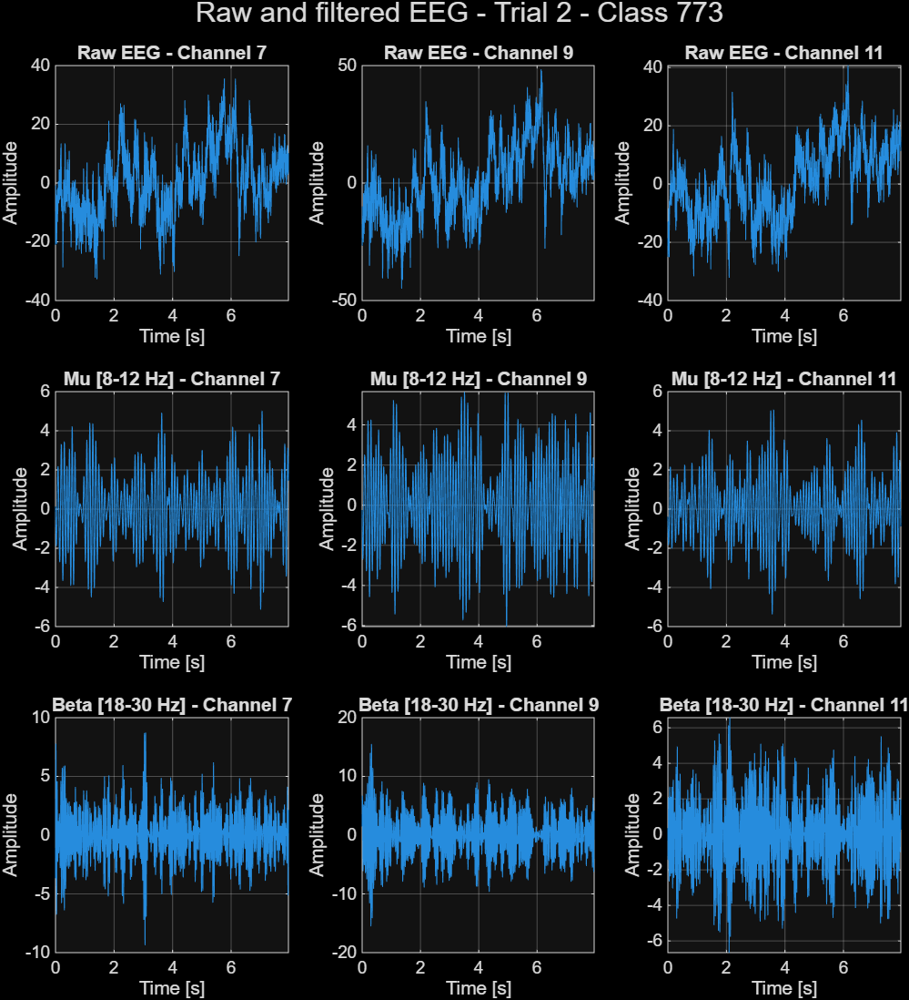
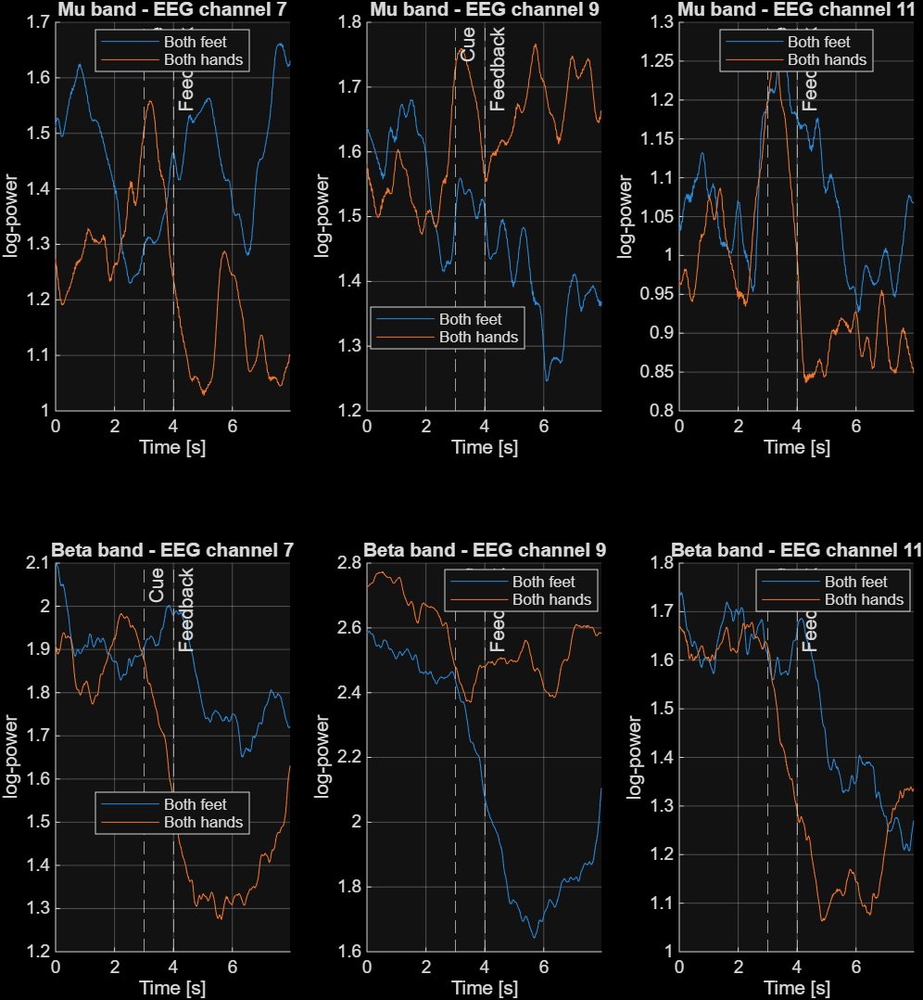

# Lab04 - MI BMI Logarithmic Band Power

Neurorobotics 2025/2026

## Goal

The goal of this lab is to compute logarithmic band power features from offline EEG motor imagery recordings.

The processing focuses on the sensorimotor frequency bands commonly used in motor imagery BCI:

- Mu band: 8-12 Hz
- Beta band: 18-30 Hz

The extracted features will be reused in later labs for spatial filtering, ERD/ERS analysis, feature selection, and classification.

---

## What the lab requires

The Lab04 document asks to:

1. Load all offline GDF files.
2. Concatenate EEG data and event information.
3. Filter the EEG signal in the mu and beta bands.
4. Square the filtered signal.
5. Apply a 1-second moving average.
6. Apply a logarithmic transform.
7. Extract trials for the two motor imagery classes.
8. Visualize raw/filtered signals and averaged log-bandpower.

---

## Files created

```text
matlab/labs/lab04_bandpower/
├── README.md
├── lab04_log_bandpower.m
└── images/
    ├── Lab04_RawAndFilteredSignals.png
    └── Lab04_AveragedLog_bandpowerByClass.png

matlab/utils/
└── compute_log_bandpower.m
```

---

## Input data

The script expects the offline GDF files to be stored in:

```text
matlab/data/raw/
```

Expected files:

```text
ah7.20170613.161402.offline.mi.mi_bhbf.gdf
ah7.20170613.162331.offline.mi.mi_bhbf.gdf
ah7.20170613.162934.offline.mi.mi_bhbf.gdf
```

These files must not be committed to Git.

---

## Utility functions used

The script reuses the utilities developed in previous labs:

| Function | Role |
|---|---|
| `load_gdf_file.m` | Loads one GDF file and separates EEG from trigger |
| `concat_gdf_runs.m` | Concatenates multiple GDF runs and corrects event positions |
| `create_label_vectors.m` | Creates sample-wise label vectors from GDF events |
| `extract_trials.m` | Extracts trial-based EEG matrices |
| `compute_log_bandpower.m` | Computes logarithmic band power features |

---

## Processing pipeline

The Lab04 processing chain is:

```text
Raw EEG
  -> Butterworth bandpass filtering
  -> zero-phase filtering with filtfilt
  -> squaring
  -> 1-second moving average
  -> logarithmic transform
  -> trial extraction
  -> class-wise averaging
```

The two frequency bands are processed separately:

```matlab
muBand   = [8 12];
betaBand = [18 30];
```

The Butterworth filter is applied with zero-phase filtering:

```matlab
filteredData = filtfilt(b, a, double(data));
```

The power estimate is computed by squaring the filtered signal and smoothing it over a 1-second moving window:

```matlab
squaredData = filteredData .^ 2;
powerData = movmean(squaredData, movingWindowSamples, 1);
logPower = log(powerData + epsilonValue);
```

---

## Trial extraction

Trials are extracted from the fixation cross event:

```matlab
trialStartEvent = 786;
```

The two motor imagery classes are:

| Event code | Class |
|---:|---|
| `771` | Both feet |
| `773` | Both hands |

For the current dataset, 90 trials are extracted:

```text
45 both-feet trials
45 both-hands trials
```

The extracted trial matrices have the format:

```text
[samples_per_trial x selected_channels x trials]
```

In the current run, this was:

```text
4075 x 3 x 90
```

---

## Visualizations

The script generates two figures saved in:

```text
matlab/labs/lab04_bandpower/images/
```

### Figure 1 - Raw and filtered signals

This figure shows one selected trial.

Rows correspond to:

1. Raw EEG
2. Mu-filtered EEG
3. Beta-filtered EEG

Columns correspond to the selected EEG channels.

This layout avoids overlapping several EEG channels in the same plot and makes the filtering effect easier to inspect.



### Figure 2 - Averaged log-bandpower by class

This figure shows the averaged log-bandpower for both motor imagery classes.

Rows correspond to:

1. Mu band
2. Beta band

Columns correspond to selected EEG channels.

Each subplot compares:

- Both feet (`771`)
- Both hands (`773`)

Vertical lines indicate:

- Cue onset
- Feedback onset



---

## Channel selection

The script currently uses:

```matlab
selectedChannels = [7 9 11];
```

These are selected EEG channel indices for visualization only.

The GDF header labels are generic:

```text
eeg:1
eeg:2
...
eeg:16
```

Therefore, no anatomical interpretation is made at this stage.

In later analyses, especially for Assignment 1, the official electrode layout must be used before interpreting channels as specific motor cortex locations such as C3, Cz, or C4.

---

## Important interpretation notes

This lab produces log-bandpower features, but it does not yet prove that the two classes are clearly separable.

A weak visual separation in Lab04 is not necessarily an error.

More advanced steps will be introduced later:

- Spatial filtering
- ERD/ERS normalization
- Feature selection
- Classification

Therefore, the main validation criterion for this lab is that the processing pipeline runs correctly and produces interpretable figures.

---

## Current Lab04 status

Completed:

- Offline GDF files loaded.
- EEG runs concatenated.
- Event positions corrected by `concat_gdf_runs.m`.
- Label vectors created.
- Log-bandpower computed in mu and beta bands.
- Trials extracted for both MI classes.
- Raw/filtered EEG figure generated.
- Averaged log-bandpower figure generated.

Results obtained:

```text
Total samples: 500736
EEG channels: 16
Sampling rate: 512 Hz
Events: 360
Trials: 90
Both feet: 45 trials
Both hands: 45 trials
Selected channels: [7 9 11]
```