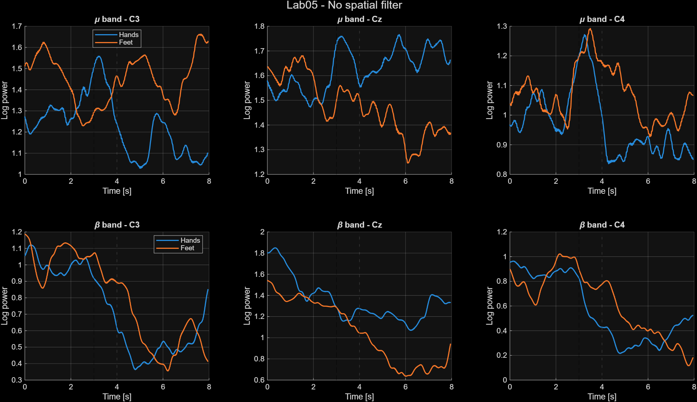
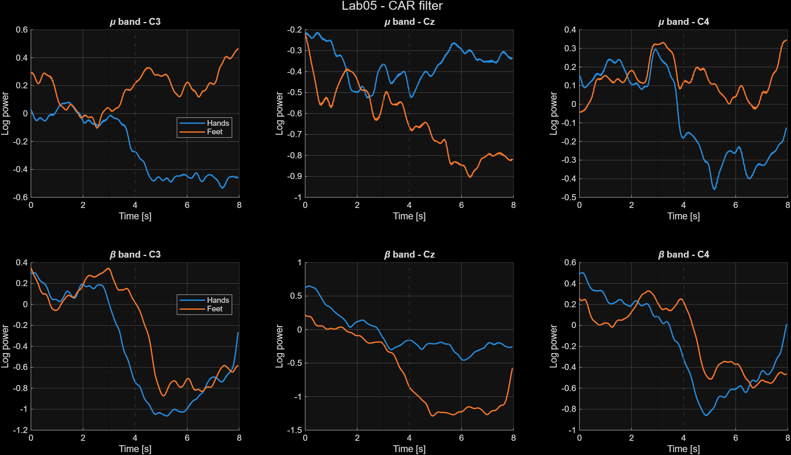
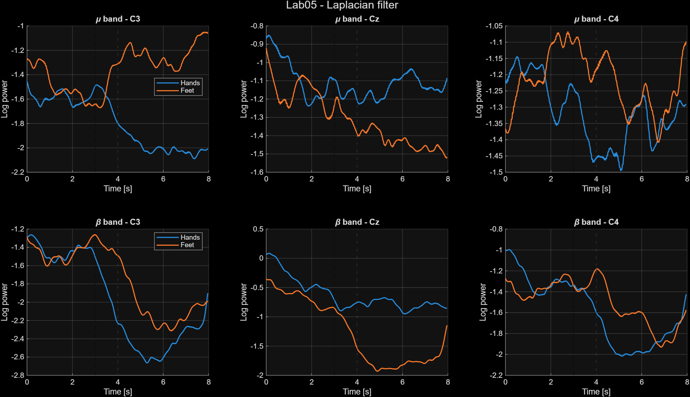

# Lab05 - Spatial filters on logarithmic band power

Neurorobotics 2025/2026

## Goal

The goal of this lab is to compare logarithmic band power features computed from EEG data under three spatial filtering conditions:

1. No spatial filter
2. Common Average Reference (CAR)
3. Laplacian filter

This lab extends the Lab04 logarithmic band power pipeline by adding spatial filters before the frequency-domain processing.

## Scientific objective

Motor imagery modulates sensorimotor rhythms, especially in the mu and beta bands, over motor cortex areas. Spatial filtering can improve the visibility of these modulations by reducing common activity across channels or emphasizing local cortical activity.

The expected comparison is therefore:

```text
raw EEG
  -> logarithmic band power

CAR-filtered EEG
  -> logarithmic band power

Laplacian-filtered EEG
  -> logarithmic band power
```

The comparison is performed on three motor channels:

```text
C3, Cz, C4
```

## Input files

The script uses the three offline GDF files:

```text
matlab/data/raw/
├── ah7.20170613.161402.offline.mi.mi_bhbf.gdf
├── ah7.20170613.162331.offline.mi.mi_bhbf.gdf
└── ah7.20170613.162934.offline.mi.mi_bhbf.gdf
```

The Laplacian spatial filter is loaded from:

```text
matlab/data/external/laplacian16.mat
```

This file is provided separately on Moodle and must not be recreated manually.

## Main script

```text
matlab/labs/lab05_spatial_filters/lab05_spatial_filters.m
```

The script performs the following steps:

1. Load and concatenate the offline GDF files.
2. Concatenate the event structures with corrected positions.
3. Apply one spatial filtering condition:
   - none
   - CAR
   - Laplacian
4. Compute logarithmic band power in:
   - mu band: 8-12 Hz
   - beta band: 18-22 Hz
5. Extract trials from fixation cross to the end of continuous feedback.
6. Average the logarithmic band power for both motor imagery classes.
7. Visualize the results for C3, Cz and C4.

## Event codes

The relevant event codes are:

| Event | Code | Meaning |
|---|---:|---|
| Fixation cross | 786 | Start of the trial period used for extraction |
| Both feet | 771 | Motor imagery class |
| Both hands | 773 | Motor imagery class |
| Continuous feedback | 781 | Feedback period |
| Target hit | 897 | Trial result |
| Target miss | 898 | Trial result |

## Spatial filters

### No spatial filter

The raw EEG matrix is used directly:

```matlab
S_spatial = S_eeg_all;
```

This condition acts as the baseline.

### CAR filter

The CAR filter subtracts the average activity across all EEG channels at each time sample:

```matlab
S_car = S - mean(S, 2);
```

This reduces global activity shared by many channels.

### Laplacian filter

The Laplacian filter is applied using the provided 16-channel mask:

```matlab
load('laplacian16.mat');
S_lap = S * lap;
```

This emphasizes local activity and is particularly relevant for motor cortex channels.

## Frequency processing

For each spatial filtering condition, the script computes logarithmic band power separately for:

```text
mu band   = 8-12 Hz
beta band = 18-22 Hz
```

The processing pipeline is inherited from Lab04:

```text
band-pass filtering
-> signal rectification
-> 1-second moving average
-> logarithmic transform
```

## Visualizations

The final visualization uses one figure per spatial filtering condition.

Each figure contains six subplots:

```text
row 1: mu band
row 2: beta band

columns:
C3, Cz, C4
```

The expected image folder is:

```text
matlab/labs/lab05_spatial_filters/images/
```

### No spatial filter

This figure is the baseline condition. It shows the logarithmic band power without any spatial filtering.



### CAR filter

This figure shows the same processing pipeline after applying the Common Average Reference filter.



### Laplacian filter

This figure shows the same processing pipeline after applying the Laplacian spatial filter.



## Interpretation guidelines

When comparing the figures, look for:

- clearer separation between hands and feet classes,
- stronger modulation in mu and beta bands,
- channel-specific effects over C3, Cz and C4,
- reduction of noisy common activity after CAR,
- stronger localized sensorimotor patterns after Laplacian filtering.

A clean result does not necessarily mean that all channels separate both classes. Motor imagery effects are spatially and spectrally specific. It is normal if only some channels and bands show clear differences.

## Files created or modified

```text
matlab/labs/lab05_spatial_filters/
├── lab05_spatial_filters.m
├── README.md
└── images/
    ├── Lab05_NoSpatialFilter_LogBandpower.png
    ├── Lab05_CAR_LogBandpower.png
    └── Lab05_Laplacian_LogBandpower.png
```

Utility functions used:

```text
matlab/utils/load_gdf_file.m
matlab/utils/concat_gdf_runs.m
matlab/utils/extract_trials.m
matlab/utils/compute_log_bandpower.m
matlab/utils/apply_car_filter.m
matlab/utils/apply_laplacian_filter.m
```