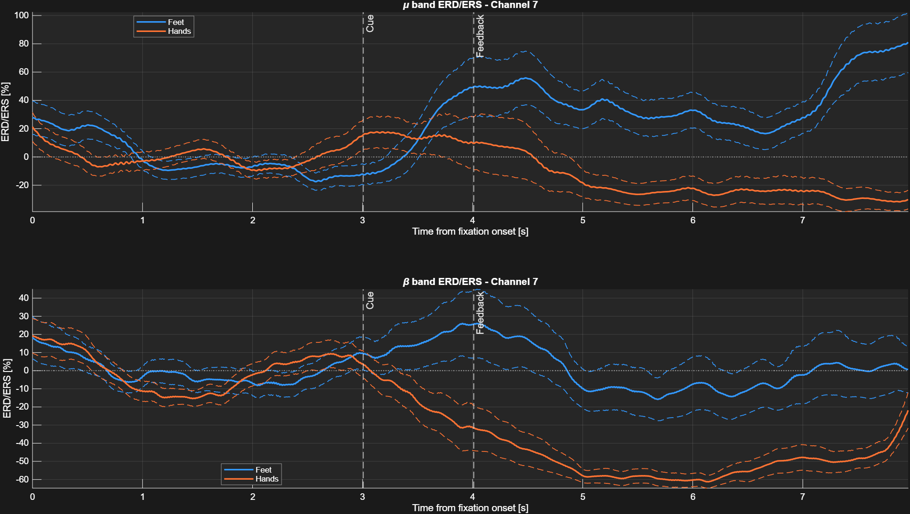
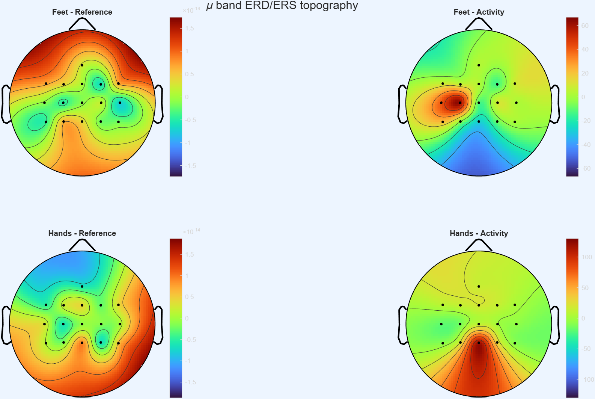

# Lab06 - ERD/ERS on band power

Neurorobotics 2025/2026

## Goal

The goal of this lab is to compute the **Event-Related Desynchronization / Synchronization (ERD/ERS)** of the mu and beta band power during motor imagery, and to visualize it both in time and over the scalp.

This lab extends the Lab05 spatial-filtering pipeline. The main differences are:

- a **Laplacian** spatial filter is always applied to the data;
- the band power is computed **without** the logarithmic transform, because the data is normalized by the reference period through the ERD/ERS formula instead.

## Scientific objective

Motor imagery modulates the sensorimotor rhythms. Relative to a rest/fixation baseline:

- **ERD** (desynchronization) is a *decrease* of band power (negative values),
- **ERS** (synchronization) is an *increase* of band power (positive values).

For the two classes of this dataset (both hands, both feet), the expected pattern over the hand area channel **C3** is a clear ERD for *both hands* and a relative ERS for *both feet* during the activity period.

## What the lab requires

The Lab06 document asks to:

1. Import and concatenate all the offline GDF files.
2. Apply a Laplacian spatial filter (`s_lap = s * lap`).
3. Filter the signal in the mu and beta bands (Butterworth + `filtfilt`).
4. Rectify (square) and apply a 1-second moving average.
5. **Do not** apply the logarithmic transform (the ERD/ERS normalization replaces it).
6. Extract trials for the two MI tasks.
7. Compute ERD/ERS using the fixation period as reference and the continuous feedback as activity.
8. Visualize ERD/ERS in time (selected channel) and over the scalp (topoplots).

## Input files

The script uses the three offline GDF files:

```text
matlab/data/raw/
├── ah7.20170613.161402.offline.mi.mi_bhbf.gdf
├── ah7.20170613.162331.offline.mi.mi_bhbf.gdf
└── ah7.20170613.162934.offline.mi.mi_bhbf.gdf
```

Two external files are loaded from Moodle:

```text
matlab/data/external/laplacian16.mat   # Laplacian spatial mask [16 x 16]
matlab/data/external/chanlocs16.mat    # channel locations for the topoplots
```

These files are provided separately and must not be recreated manually or committed to Git.

## Main script

```text
matlab/labs/lab06_erd_ers_bandpower/lab06_erd_ers_bandpower.m
```

The script performs the following steps:

1. Load and concatenate the offline GDF files.
2. Apply the Laplacian spatial filter.
3. Compute mu and beta band power **without** the log transform.
4. Extract, for each trial, the fixation period (reference) and the whole trial up to the end of the continuous feedback (activity).
5. Build the trial and fixation 3D matrices `[samples x channels x trials]`.
6. Compute ERD/ERS.
7. Plot the temporal ERD/ERS for both classes on the selected channel.
8. Plot the spatial ERD/ERS topographies (reference vs activity, both classes).

## Utility functions used

| Function | Role |
|---|---|
| `load_gdf_file.m` | Loads one GDF file and separates EEG from trigger |
| `concat_gdf_runs.m` | Concatenates multiple GDF runs and corrects event positions |
| `apply_laplacian_filter.m` | Applies the 16-channel Laplacian spatial mask |
| `compute_bandpower.m` | Computes band power (called with `ApplyLog = false`) |

Note: unlike Lab04/Lab05, this lab does **not** use `extract_trials.m`. It builds the trial and fixation windows directly from the event structure, because it needs the fixation period separately as the ERD/ERS reference.

## Event codes

| Event | Code | Meaning |
|---|---:|---|
| Fixation cross | 786 | Start of the trial / reference period |
| Both feet | 771 | Motor imagery class |
| Both hands | 773 | Motor imagery class |
| Continuous feedback | 781 | Activity period |

## Configuration

```matlab
muBand   = [8 12];
betaBand = [18 30];

filterOrder     = 4;
movingWindowSec = 1;

selectedChannel = 7;   % C3 in the 16-channel layout (7 = C3, 9 = Cz, 11 = C4)
```

The channel of interest is **C3 (index 7)**, which is the meaningful channel for the hand motor area. Using the wrong index (for example 3) leads to weak, poorly separated curves.

## ERD/ERS computation

The reference is the average band power over the fixation period of each trial, replicated to the trial length:

```matlab
Reference = repmat(mean(FixData, 1), [size(TrialData, 1) 1 1]);
ERD = 100 * (TrialData - Reference) ./ Reference;
```

where:

```text
FixData   = fixation period   [samples x channels x trials]
TrialData = whole trial period [samples x channels x trials]
```

The ERD/ERS is computed per trial and then averaged across trials for each class.

## Visualizations

The script generates two figures. Export them into:

```text
matlab/labs/lab06_erd_ers_bandpower/images/
```

### Figure 1 - Temporal ERD/ERS

Average ERD/ERS (with standard error) over time for both classes, on channel C3, for the mu band (top) and beta band (bottom). Vertical lines mark the cue and feedback onsets; the horizontal line marks the 0% baseline.



### Figure 2 - Spatial ERD/ERS (mu band)

Topographic maps of the average mu ERD/ERS during the reference period and the activity period, for both classes:

```text
row 1: both feet   (reference | activity)
row 2: both hands  (reference | activity)
```



## Interpretation guidelines

When inspecting the figures, look for:

- a clear **ERD** (negative) for *both hands* over C3 during the activity period in the mu band,
- a relative **ERS** (positive) for *both feet*,
- maps that are close to 0% during the reference period (expected, since the reference overlaps the fixation baseline) and that show the strongest modulation during the activity period.

It is normal that the separation is clearer on the mu band and on the motor channels. Motor imagery effects are spatially and spectrally specific.

## Files created or modified

```text
matlab/labs/lab06_erd_ers_bandpower/
├── README.md
├── lab06_erd_ers_bandpower.m
└── images/
    ├── Lab06_Temporal_ERD_ERS.png
    └── Lab06_Spatial_ERD_ERS_mu.png
```
