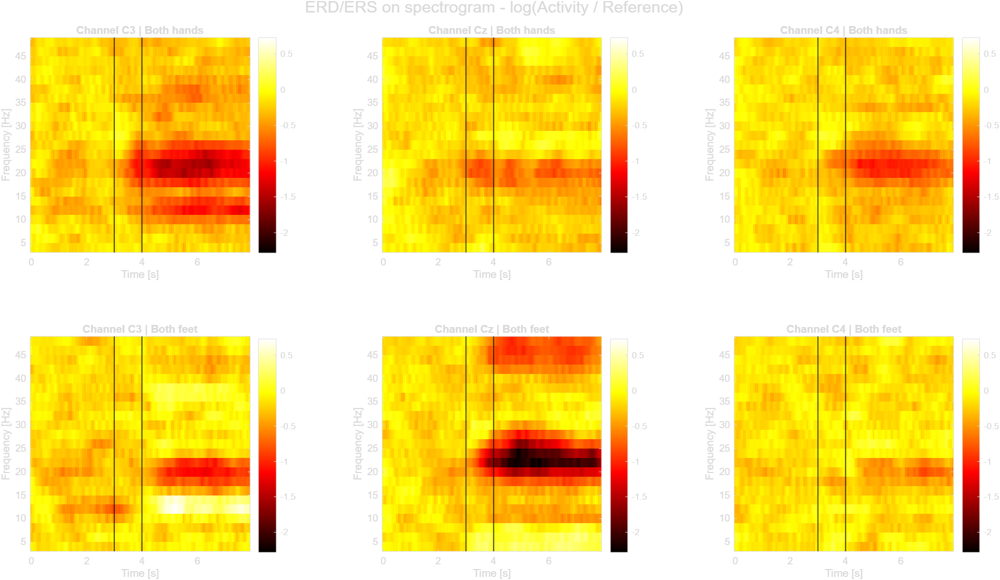

# Lab07 - ERD/ERS on spectrogram

Neurorobotics 2025/2026

## Goal

The goal of this lab is to compute the **ERD/ERS in the time-frequency domain**, using a spectrogram (PSD over time) instead of a single band power. This gives, for each channel, a full time × frequency map of the desynchronization / synchronization during motor imagery.

This lab extends Lab06: instead of two fixed bands (mu, beta), the band power is replaced by a PSD computed on a grid of frequencies, so the ERD/ERS can be inspected across the whole 4-48 Hz range.

## Scientific objective

As in Lab06, relative to the fixation baseline:

- **ERD** (desynchronization) is a *decrease* of power,
- **ERS** (synchronization) is an *increase* of power.

The time-frequency maps make the band-specific and time-specific structure of these modulations directly visible (e.g. beta ERD over C3/C4 for hands, central ERD/ERS over Cz for feet).

## Two-script architecture

Computing the PSD with overlapping windows is time-consuming, so the lab is split into two scripts (as suggested in the Lab07 slides):

```text
script 1 | processing   ->  heavy PSD computation, saved once as .mat
script 2 | ERD/ERS       ->  loads the .mat, computes and plots the ERD/ERS
```

| Script | File | Role |
|---|---|---|
| 1 | `lab07_01_processing.m` | Per-run: Laplacian + spectrogram + frequency selection + event conversion, then save `.mat` |
| 2 | `lab07_02_erd_ers.m` | Load + concatenate `.mat`, build 4D matrices, compute ERD/ERS, visualize |

## Input files

The scripts use the three offline GDF files:

```text
matlab/data/raw/
├── ah7.20170613.161402.offline.mi.mi_bhbf.gdf
├── ah7.20170613.162331.offline.mi.mi_bhbf.gdf
└── ah7.20170613.162934.offline.mi.mi_bhbf.gdf
```

The Laplacian mask is loaded from:

```text
matlab/data/external/laplacian16.mat
```

Script 1 writes its output to:

```text
matlab/data/processed/
├── ah7.20170613.161402.offline.mi.mi_bhbf.mat
├── ah7.20170613.162331.offline.mi.mi_bhbf.mat
└── ah7.20170613.162934.offline.mi.mi_bhbf.mat
```

These `.mat` files are intermediate results and are not committed to Git (ignored by `*.mat` and `data/processed/`).

## Utility functions used

| Function | Role | Source |
|---|---|---|
| `load_gdf_file.m` | Loads one GDF file and separates EEG from trigger | student |
| `proc_spectrogram.m` | Computes the PSD over time (spectrogram) | provided (Moodle) |
| `proc_pos2win.m` | Converts event positions from samples to PSD windows | provided (Moodle) |

Note: the Laplacian is applied directly with `s_lap = s * lap` (as in the document), not through `apply_laplacian_filter.m`. Script 2 builds the trial matrices inline, because it needs the fixation period separately as the ERD/ERS reference.

## Event codes

| Event | Code | Meaning |
|---|---:|---|
| Fixation cross | 786 | Start of the trial / reference period |
| Both feet | 771 | Motor imagery class |
| Both hands | 773 | Motor imagery class |
| Continuous feedback | 781 | Activity period |

## Script 1 - processing

For each GDF file separately:

1. Load the GDF file.
2. Apply the Laplacian spatial filter (`s_lap = s * lap`).
3. Compute the PSD over time with `proc_spectrogram`:

```matlab
wlength = 0.5;      % s, external window length
wshift  = 0.0625;   % s, external window shift
pshift  = 0.25;     % s, internal PSD window shift
mlength = 1;        % s, moving average length
[PSD, f] = proc_spectrogram(s_lap, wlength, wshift, pshift, samplerate, mlength);
% PSD: [windows x frequencies x channels]
```

4. Select a meaningful frequency subset (4-48 Hz, step 2 Hz) → 23 frequencies.
5. Convert the event positions and durations from samples to windows:

```matlab
EVENT.POS = proc_pos2win(POS, wshift*fs, 'backward', wlength*fs);
EVENT.DUR = floor(DUR / (wshift*fs));   % duration in number of windows
```

6. Save `PSD`, `freqs`, `EVENT`, `samplerate` and a `cfg` structure into one `.mat` per run.

At 512 Hz the spectrogram has a 2 Hz frequency resolution and one window every 0.0625 s (16 windows/s).

## Script 2 - ERD/ERS

1. Load and concatenate the processed `.mat` files (PSD along the window dimension; event positions shifted by the cumulative window count).
2. Extract trials: each trial goes from the fixation cross (786) to the end of the continuous feedback (781). The reference is the fixation period only.
3. Build the 4D matrices:

```text
Activity  [windows x frequencies x channels x trials]
Reference [windows x frequencies x channels x trials]
```

4. Compute the ERD/ERS trial by trial:

```matlab
Baseline = repmat(mean(Reference, 1), [size(Activity, 1) 1 1 1]);
ERD = log(Activity ./ Baseline);
% alternative percentage form:
% ERD = 100 * (Activity - Baseline) ./ Baseline;
```

The **log** form is used because it matches the scale of the expected results (colorbar roughly +0.5 to -2).

5. Select the motor channels C3 (7), Cz (9), C4 (11) and visualize with `imagesc`.

## Visualization

The figure shows the trial-averaged ERD/ERS for the two classes, with rows = classes and columns = channels:

```text
row 1: both hands   (C3 | Cz | C4)
row 2: both feet    (C3 | Cz | C4)
```

Each panel is a time (x) × frequency (y) map, with vertical lines at the cue and feedback onsets and a common color scale across panels.



## Interpretation guidelines

Expected patterns (and obtained here):

- **Both hands**: clear beta ERD (~18-25 Hz) during the activity period over **C3** and **C4**; weak over Cz.
- **Both feet**: strongest ERD over central **Cz** in beta; over C3 a low-frequency ERS band (~10-12 Hz) is also visible.
- The reference period (before the first vertical line) stays close to 0, as expected since it overlaps the fixation baseline.

## Files created or modified

```text
matlab/labs/lab07_erd_ers_spectrogram/
├── README.md
├── lab07_01_processing.m
├── lab07_02_erd_ers.m
└── images/
    └── Lab07_ERD_ERS_spectrogram.png

matlab/utils/
├── proc_spectrogram.m   (provided)
└── proc_pos2win.m       (provided)
```
