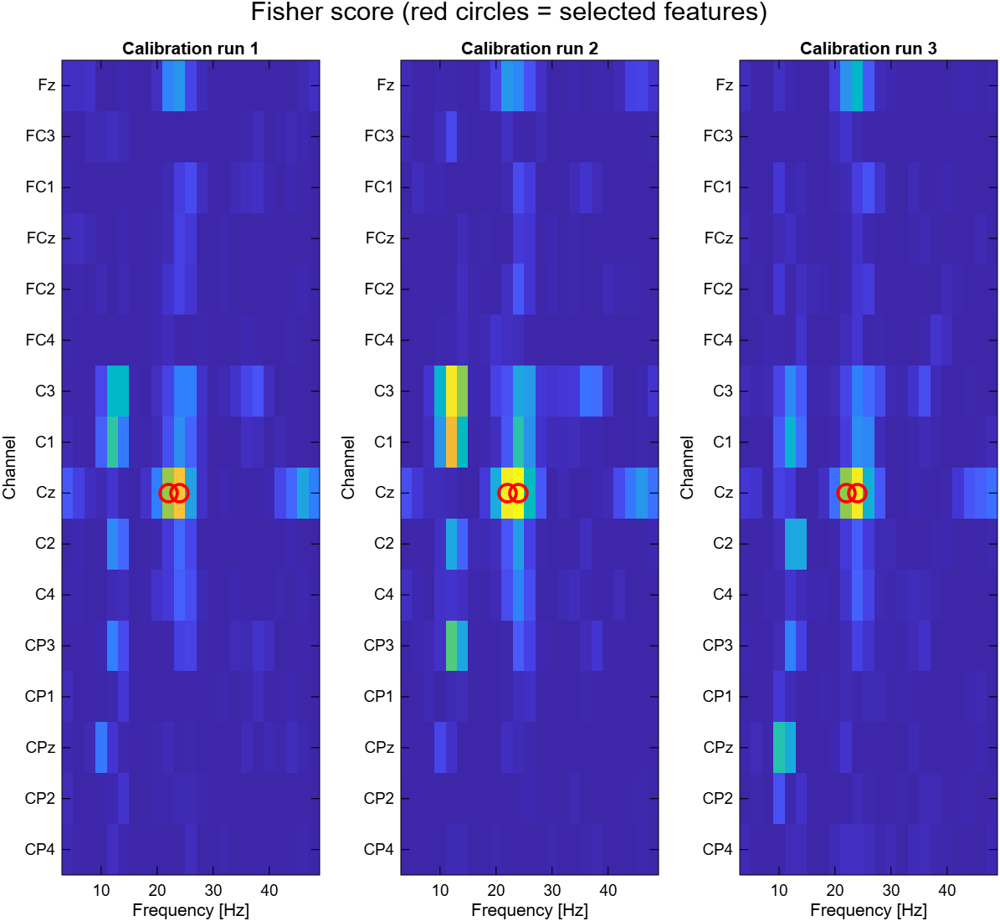
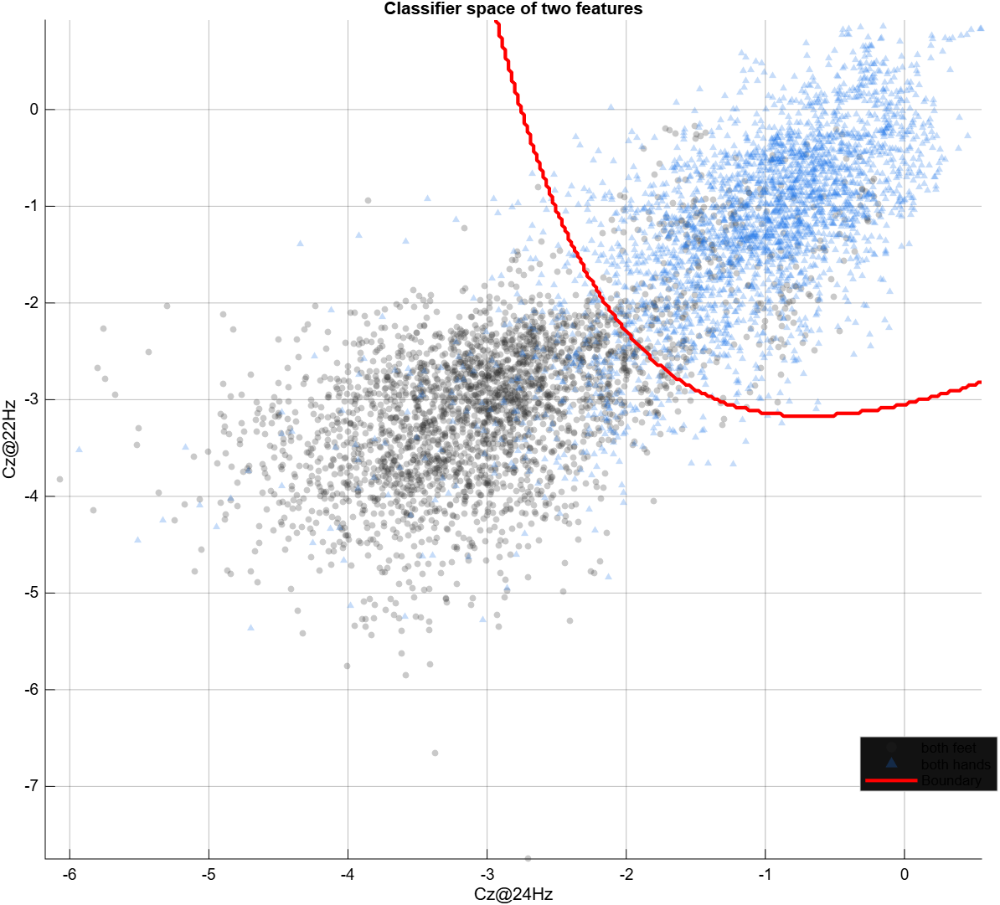
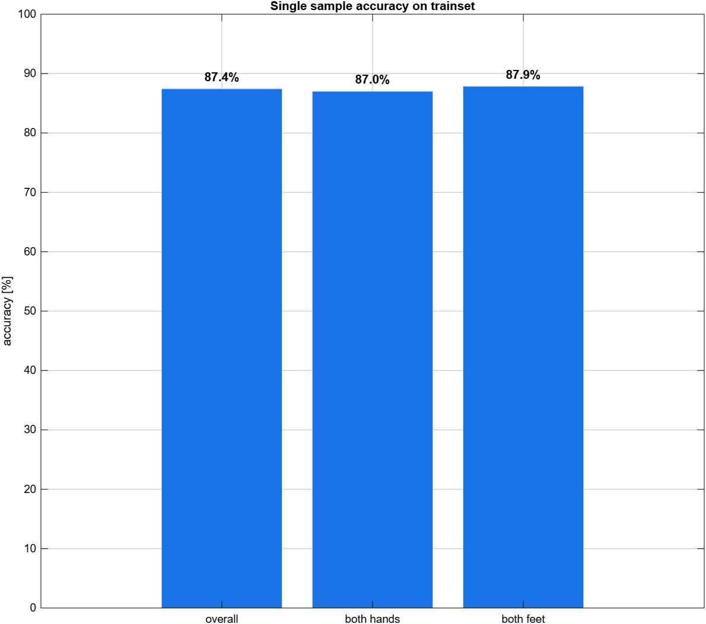

# Lab08 - Feature selection and classification

Neurorobotics 2025/2026

## Goal

The goal of this lab is to turn the time-frequency features into an actual **motor-imagery decoder**: rank every channel-frequency feature by discriminability (Fisher score), keep the most informative ones, train an LDA/QDA classifier, and evaluate its single-sample accuracy.

This closes the offline BMI pipeline: from raw EEG to a trained decoder.

## Relationship to Lab07

The processing step (script 1 of the assignment: load GDF → Laplacian → `proc_spectrogram` → frequency selection → event conversion → save `.mat`) is **identical to Lab07** and is therefore **not repeated**. This lab reuses the `.mat` files already produced by `lab07_01_processing.m` in `matlab/data/processed/`.

So Lab08 is a single analysis script that loads the processed data and performs feature selection + classification (the "Analysis X" branch of the two-script workflow).

## Input files

```text
matlab/data/processed/
├── ah7.20170613.161402.offline.mi.mi_bhbf.mat
├── ah7.20170613.162331.offline.mi.mi_bhbf.mat
└── ah7.20170613.162934.offline.mi.mi_bhbf.mat
```

If these files are missing, run `lab07_01_processing.m` first.

## Main script

```text
matlab/labs/lab08_feature_selection_classification/lab08_feature_selection_classification.m
```

## Utility functions used

| Function | Role | Source |
|---|---|---|
| `compute_fisher_score.m` | Two-class feature discriminability (Fisher score) | student |

The PSD itself was computed in Lab07 with the provided `proc_spectrogram.m` and `proc_pos2win.m`. Classification uses MATLAB's `fitcdiscr` / `predict` (Statistics and Machine Learning Toolbox). The per-window label vectors and the `.mat` concatenation are built inline (their interface will be generalized in Lab09, when online runs are added).

## Event codes

| Event | Code | Meaning |
|---|---:|---|
| Fixation cross | 786 | Start of the trial |
| Both feet | 771 | Motor imagery class |
| Both hands | 773 | Motor imagery class |
| Continuous feedback | 781 | Training period (windows used for the decoder) |

## Pipeline

1. Load and concatenate the processed `.mat` (PSD along windows; events shifted by the cumulative window count; run index per window).
2. Build per-window label vectors: `Ck` (class active during the trial), `CFbk` (781 during continuous feedback), `Rk` (run index).
3. Build the feature matrix `F = log(PSD)` reshaped to `[windows x features]` (16 channels × 23 frequencies = 368 features), keeping the mapping feature → channel/frequency.
4. Compute the **Fisher score** of every feature (per run for the maps, overall for the selection), on the continuous-feedback windows.
5. Select the top `nSelected` features.
6. Train `fitcdiscr` (QDA by default) on the continuous-feedback windows.
7. Evaluate with `predict`; report overall and per-class accuracy.

### Methodological choices

- **Continuous-feedback windows (`CFbk == 781`)** are used for both the Fisher score and training, matching the slides' code (`LabelIdx = CFbk == 781 & Mk == 0`).
- **Features are `log(PSD)`** (log band power), consistent with the negative ranges of the expected classifier-space axes.
- **`nSelected = 2`** reproduces the 2D classifier-space figure (adjustable); **`discrimType = 'quadratic'`** (can be `linear`, etc.).
- Needs the **Statistics and Machine Learning Toolbox** (`fitcdiscr`, `predict`).

## Visualizations

### Figure 1 - Fisher score feature maps (one per run)

For each channel-frequency feature, the Fisher score measures how well it separates feet vs hands. Bright spots reveal the discriminative features; the red circles mark the selected ones. The maps are consistent across the three runs, and the strongest features fall on the sensorimotor rhythms over motor cortex (Cz ~22-24 Hz in beta, C1/C3 ~12 Hz in mu).



### Figure 2 - Classifier space of two features

Each point is a continuous-feedback window placed by its two selected features, colored by its true class, with the decision boundary in red (curved because QDA is used). Two well-separated clouds mean the features are discriminative; the overlap region corresponds to the samples that will be misclassified.



### Figure 3 - Single-sample accuracy

Percentage of correctly classified continuous-feedback windows, reported overall and per class. Comparing the classes detects any bias toward an easier class.

> ⚠️ This is the accuracy on the **training set** (same data used to fit the model), so it is optimistic. The real, unbiased evaluation is done on the **online/test runs** in Lab09.



## Interpretation guidelines

In one line per figure: Figure 1 answers *which features carry the information*, Figure 2 *are they separable*, and Figure 3 *does the decoder classify well*. Together they form the feature-selection → decision → evaluation chain.

## Files created or modified

```text
matlab/labs/lab08_feature_selection_classification/
├── README.md
├── lab08_feature_selection_classification.m
└── images/
    ├── Lab08_Fisher_feature_maps.png
    ├── Lab08_Classifier_space.png
    └── Lab08_Single_sample_accuracy.png

matlab/utils/
└── compute_fisher_score.m
```
